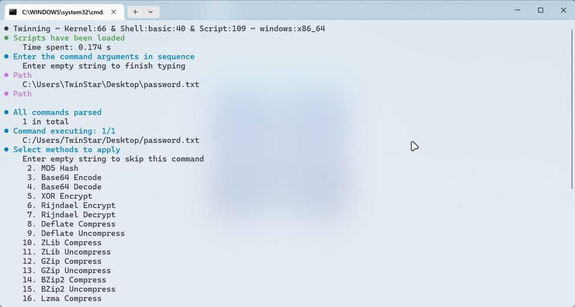
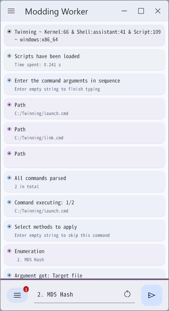
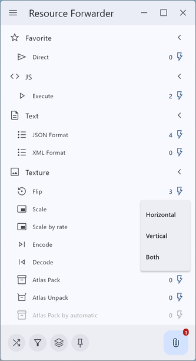
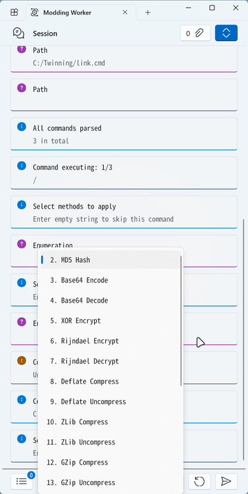
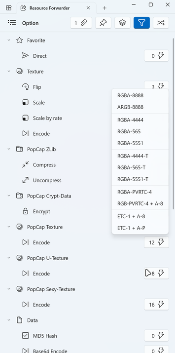
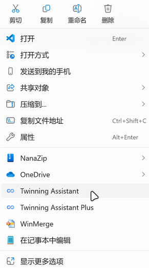

# 工具介绍

`Twinning` 是一款处理多种特定文件结构的工具箱，是 `PvZTool` 、`SPCUtil` 、`TaiJi` 的重开发，功能更加丰富、完善；前三者已停止维护，建议弃用并使用本工具。

如有 BUG ，请在 [ISSUE](https://github.com/twinstar6980/Twinning/issues) 中反馈。

## 索引

- [更新历史](./history.md)

- [安装步骤](./installation.md)

- [使用方法](./usage.md)

- [功能列表](./method.md)

- [常见问题](./question.md)

- [高级应用](./advanced.md)

## 功能

目前提供以下功能：

* `Wwise Media` (.wem)
	
	* 解码

* `Wwise Sound-Bank` (.bnk)
	
	* 编码、解码

* `Marmalade DZip` (.dz)
	
	* 打包、解包

* `PopCap ZLib` (.*)
	
	* 压缩、解压

* `PopCap Crypt-Data` (.cdat)
	
	* 加密、解密

* `PopCap Reflection-Object-Notation` (.rton)
	
	* 编码、解码
	
	* 加密、解密

* `PopCap Texture` (.ptx)
	
	* 编码、解码

* `PopCap U-Texture` (.tex|txz)
	
	* 编码、解码

* `PopCap Sexy-Texture` (.tex)
	
	* 编码、解码

* `PopCap Animation` (.pam)
	
	* 编码、解码
	
	* 与Flash格式相互转换

* `PopCap Re-Animation` (.reanim.compiled)
	
	* 编码、解码

* `PopCap Particle` (.xml.compiled)
	
	* 编码、解码

* `PopCap Trail` (.trail.compiled)
	
	* 编码、解码

* `PopCap Particle-Effect` (.ppf)
	
	* 编码、解码

* `PopCap Render-Effect` (.popfx)
	
	* 编码、解码

* `PopCap Character-Font-Widget-2` (.cfw2)
	
	* 编码、解码

* `PopCap Package` (.pak)
	
	* 打包、解包
	
	* 加密

* `PopCap Resource-Stream-Group` (.rsg)
	
	* 打包、解包

* `PopCap Resource-Stream-Bundle` (.rsb)
	
	* 打包、解包
	
	* 资源转换

* `PopCap Resource-Stream-Bundle-Patch` (.rsbpatch)
	
	* 编码、解码

* `PvZ-2 Resource-Manifest` (resources.rton|newton)
	
	* 编码、解码
	
	* 转换

* `PvZ-2 Text-Table` (.txt|json)
	
	* 转换

* `Kairosoft Game` (.*)
	
	* 加密存档
	
	* 修改程序

* ......

## 预览

 

 

